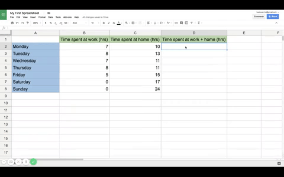

# Google Sheets

One of the primary application is the web-based spreadsheet editor, Google Sheets, which allows users to format and edit spreadsheets with other users simultaneously. This tool is very similar to Microsoft Excel. The documents created with Google Sheets are compatible with Microsoft Excel files (.xlsx) and comma delimited values (.csv).  

Google Sheets can be opened multiple ways. The simplest option for starting a new document is going to the Google Sheets URL https://sheets.google.com/spreadsheets/u/0/. Under "Start a new spreadsheet" select the blank option or any of the templates available. 

Clicking on "TEMPLATE GALLERY" will expand the template options to include "Personal," "Work," and "Education" templates. If the template bar is not readily visible in the given URL, it can be enabled by clicking the top left menu button , and click on the checkbox under "Templates."

Assuming that you are logged into your Google account, underneath the templates you will see the past spreadsheets that are saved on your Google Drive. Each of them can be opened and edited by clicking on them, which will redirect the current window to the old spreadsheet. The options along the top will allow sorting by owner through a dropdown list. 

In addition, you can open spreadsheets through Google Drive through going to the URL https://drive.google.com and clicking on NEW and selecting Google Sheets. 

## Using Google Sheets

Google Sheets operates very similarly to Microsoft Excel sans a couple of Excel's more advanced features. However, most tasks can be done with Google Sheets, including large table and data manipulations, graphs and visualizations. There are more in-depth guides on [modifying columns and rows](https://www.gcflearnfree.org/googlespreadsheets/modifying-columns-rows-and-cells/1/), [formatting cells](https://www.gcflearnfree.org/googlespreadsheets/formatting-cells/1/), and [working with multiple sheets](https://www.gcflearnfree.org/googlespreadsheets/working-with-multiple-sheets/1/).

This is an example of a simple task on Google Sheets. The third column is the sum of the first two columns.

Similar to Google Docs, one of the most convenient features of Google Sheets and its applications is its auto save. As soon as the application detects a change in the file, it will periodically save without any prompt from the user. No more worries about losing progress when the power goes out, the internet disconnects, or even when a computer breaks down. 

And again, you can work with Google Sheets in offline mode on your Chromebook. Refer to the instruction in the previous lesson for further detail.

### Slides and Video

* [Slides](ADD SLIDES LINK)